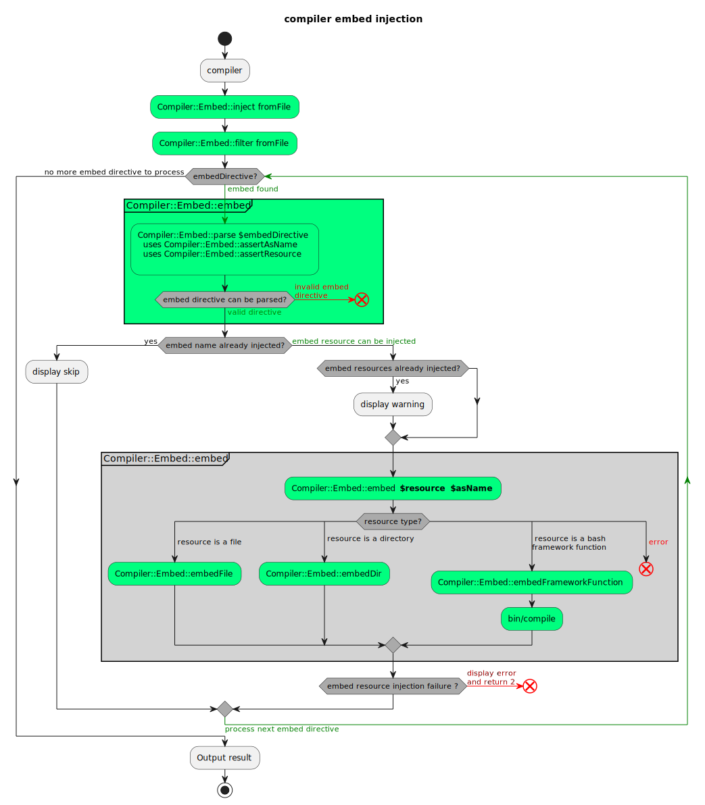

# Compile Command

- [1. Why ?](#1-why-)
- [2. Compile tool](#2-compile-tool)
- [3. compile command help](#3-compile-command-help)
  - [3.1. .framework-config environment variables](#31-framework-config-environment-variables)
  - [3.2. Template variables](#32-template-variables)
  - [3.3. Bash-tpl templating](#33-bash-tpl-templating)
  - [3.4. Bash-tpl macros](#34-bash-tpl-macros)
    - [3.4.1. dynamicTemplateDir](#341-dynamictemplatedir)
    - [3.4.2. dynamicSrcFile](#342-dynamicsrcfile)
    - [3.4.3. dynamicSrcDir](#343-dynamicsrcdir)
  - [3.5. directives and template](#35-directives-and-template)
    - [3.5.1. `# FUNCTIONS` directive](#351--functions-directive)
    - [3.5.2. bash framework functions](#352-bash-framework-functions)
    - [3.5.3. `VAR_*` directive (optional)](#353-var_-directive-optional)
    - [3.5.4. `BIN_FILE` directive (optional)](#354-bin_file-directive-optional)
  - [3.6. REQUIRE directive (optional)](#36-require-directive-optional)
    - [3.6.1. What is a requirement ?](#361-what-is-a-requirement-)
    - [3.6.2. REQUIRE directive syntax](#362-require-directive-syntax)
      - [3.6.2.1. Requires naming convention](#3621-requires-naming-convention)
      - [3.6.2.2. Best practice #1: feature name](#3622-best-practice-1-feature-name)
      - [3.6.2.3. Best practice #2: support method](#3623-best-practice-2-support-method)
    - [3.6.3. Requirement overloading](#363-requirement-overloading)
    - [3.6.4. Requirement disable](#364-requirement-disable)
  - [3.6. COMPATIBILITY directive (optional)](#36-compatibility-directive-optional)
    - [3.6.1. requirement vs compatibility ?](#361-requirement-vs-compatibility-)
    - [3.6.1. COMPATIBILITY directive syntax](#361-compatibility-directive-syntax)
    - [@compatibility tag syntax](#compatibility-tag-syntax)
  - [3.7. `IMPLEMENT` and `FACADE` directives (optional)](#37-implement-and-facade-directives-optional)
    - [3.7.1. `IMPLEMENT` directive (optional)](#371-implement-directive-optional)
    - [3.7.2. `FACADE` directive (optional)](#372-facade-directive-optional)
      - [3.7.2.1. Overview](#3721-overview)
      - [3.7.2.2. Generated script](#3722-generated-script)
  - [3.8. `EMBED` directive (optional)](#38-embed-directive-optional)
  - [3.9. `.framework-config` framework configuration file](#39-framework-config-framework-configuration-file)
- [4. Compiler algorithms](#4-compiler-algorithms)
  - [4.1. Compiler - Compiler::Requirement::require](#41-compiler---compilerrequirementrequire)
    - [4.1.1. Requires dependencies](#411-requires-dependencies)
    - [4.1.2. disable compiler requirement management](#412-disable-compiler-requirement-management)
    - [4.1.3. override requirements dependency order](#413-override-requirements-dependency-order)
  - [4.2. Compiler - Compiler::Implement::interface](#42-compiler---compilerimplementinterface)
  - [4.2. Compiler - Compiler::Facade::generate](#42-compiler---compilerfacadegenerate)
  - [4.3. Compiler - Compiler::Embed::embed](#43-compiler---compilerembedembed)
- [5. FrameworkLint](#5-frameworklint)
- [6. Best practices](#6-best-practices)
- [7. Acknowledgements](#7-acknowledgements)

## 1. Why ?

Scripts using multiple sourced files are not easy to distribute. We usually
distribute those as archives and rely on the end user to unpack and run them
from a predetermined location. To improve the experience we can instead prepare
a single script with other files embedded inside it.

Here are the goals:

- The script should consist of a single file, making it easy to distribute
- The script should be copy-paste-able between systems and different editors,
  even if multiple hops are required
- Files being embedded can be binary files i.e. can contain non-printable
  characters
- The script allow bash functions reusability

The first requirement implies that we should somehow store the contents of other
files in our main script. The second requires us to avoid non-printable
characters, as they tend to cause problems when performing a copy-paste
operation. Especially when we are talking about sending such characters over
messaging programs.

## 2. Compile tool

This tool allows to detect all the framework functions used inside a given sh
file. The framework functions matches the pattern `namespace::functionName` (we
can have several namespaces separated by the characters `::`). These framework
functions will be injected inside a compiled file. The process is recursive so
that every framework functions used by imported framework functions will be
imported as well (of course only once).

You can see several examples of compiled files by checking
[src/\_binaries folder](src/_binaries). For example:

- `src/_binaries/frameworkLint.sh` generates the file `bin/frameworkLint`

## 3. compile command help

<!-- markdownlint-disable MD033 -->
<!-- markdownlint-capture -->

<a name="compileCommandHelp"></a>

<!-- markdownlint-restore -->

**Description:** This command inlines all the functions used in the script given
in parameter

**Usage:**

```text
bin/compile` [-h|--help] prints this help and exits
```

**Usage:**

```text
bin/compile <fileToCompile>
            [--src-dir|-s <srcDir>]
            [--bin-dir|-b <binDir>] [--bin-file|-f <binFile>]
            [--root-dir|-r <rootDir>] [--src-path <srcPath>]
            [--template <templateName>] [--keep-temp-files|-k]
```

**Mandatory Arguments:**

- `<fileToCompile>` the relative or absolute path to compile into one file

**Options note:** Prefer using .framework-config file, to set the compiler
options as it makes them more reusable.

**Options:**

- `--help,-h` prints this help and exits

- `--src-dir|-s <srcDir>` provide the directory where to find the functions
  source code. By default this project src directory is used.

  You can add as much --src-dir options as needed to define other source dirs.

  The functions will be searched in the order defined (it allows function
  redefinition)

  _Example:_ `--src-dir src --src-dir otherSrc`

  `Functions::myFunction` will be searched in

  - src/Functions/myFunction.sh
  - otherSrc/Functions/myFunction.sh

  **Important Note:** if you provide a `--src-dir` and you need also functions
  defined in this project, think about adding a `--src-dir` for this project
  too.

- `--bin-dir|-b <binDir>` allows to override the value of `FRAMEWORK_BIN_DIR`.
  By default FRAMEWORK_BIN_DIR is set to `bin` directory below the folder above
  `bin/compile`.

- `--bin-file|-f <binFile>` `BIN_FILE` directive will be overridden by `binFile`
  value. See more information below about directives.

- `--template-dir|-t <templateDir>` the template directory used to override some
  template includes. See more information below about environment variables.

- `--root-dir|-r <rootDir>` if you whish to override `FRAMEWORK_ROOT_DIR`
  variable.

  By default root directory is the folder above `bin/compile`.

- `--src-path <path>` if you wish to override the filepath that will be
  displayed in the header to indicate the src filepath that has been compiled
  (`SRC_FILE_PATH`).

  By default, it is initialized with path relative to `FRAMEWORK_ROOT_DIR`

- `--keep-temp-files|-k` keep temporary files for debug purpose

_Examples:_

Let's say you want to generate the binary file `bin/buildDoc` from the source
file `src/build/buildDoc.sh`

```bash
bin/compile "$(pwd)/src/_binaries/doc.sh" --src-dir "$(pwd)/src" \
  --bin-dir "$(pwd)/bin" --root-dir "$(pwd)"
```

Here you want to generate the binary but overriding some or all functions of
`vendor/bash-tools-framework/src` using `src` folder

```bash
bin/compile "$(pwd)/src/_binaries/doc.sh" --s "$(pwd)/src" \
  -s "$(pwd)/vendor/bash-tools-framework/src" --bin-dir "$(pwd)/bin" --root-dir "$(pwd)"
```

Here you want to override the default templates too

```bash
bin/compile "$(pwd)/src/_binaries/doc.sh" --s "$(pwd)/src" \
  -s "$(pwd)/vendor/bash-tools-framework/src" --bin-dir "$(pwd)/bin" \
  --root-dir "$(pwd)" --template-dir "$(pwd)/src/templates"
```

### 3.1. .framework-config environment variables

You can define global environment variables inside `.framework-config` file that
could be used in your templates.

_Example:_

- `REPOSITORY_URL`: used in template to indicate from which github repo the file
  has been generated

### 3.2. Template variables

Other variables are automatically generated to be used in your templates:

- `ORIGINAL_TEMPLATE_DIR` allowing you to include the template relative to the
  script being interpreted
- `TEMPLATE_DIR` the template directory in which you can override the templates
  defined in `ORIGINAL_TEMPLATE_DIR`

The following variables depends upon parameters passed to this script:

- `SRC_FILE_PATH` the src file you want to show at the top of generated file to
  indicate from which source file the binary has been generated.
- `SRC_ABSOLUTE_PATH` is the path of the file being compiled, it can be useful
  if you need to access a path relative to this file during compilation.

### 3.3. Bash-tpl templating

Your compiled source file will be interpreted using bash-tpl
<https://github.com/TekWizely/bash-tpl>.

You can use this feature to inline external file, interpreting environment
variables during compilation, ...

_Example:_

inline a awk script inside the resulting binary:

```bash
awkScript="\$(
cat <<'AWK_EOF'
.INCLUDE "\$(cd "\$(dirname \${SRC_ABSOLUTE_PATH})" && pwd -P)/mysql2puml.awk"
AWK_EOF
)"
```

### 3.4. Bash-tpl macros

Some macros are available to ease file path resolution according to options
passed to the compiler:

#### 3.4.1. dynamicTemplateDir

Following `-t|--template-dir` option provided to compiler command, this function
will return the file in template-dir provided if it exists or the file in
bash-tools-framework template dir if it exists, the file provided otherwise,
letting bash-tpl to manage it.

Example:

```bash
.INCLUDE "$(dynamicTemplateDir _includes/author.tpl)"
```

#### 3.4.2. dynamicSrcFile

Following `-s|--src-dir` option provided to compiler command, this function will
return the file in the first src-dir provided if it exists or the file in
bash-tools-framework src dir if it exists, the file provided otherwise, letting
bash-tpl to manage it.

```bash
# EMBED "<%% dynamicSrcFile embedDir/embedFile1 %>" as embedFile1
```

#### 3.4.3. dynamicSrcDir

Following `-s|--src-dir` option provided to compiler command, this function will
return the directory in the first src-dir provided if it exists or the directory
in bash-tools-framework src dir if it exists, the file provided otherwise,
letting bash-tpl to manage it.

```bash
# EMBED "<%% dynamicSrcDir embedDir %>" as embedDir
```

### 3.5. directives and template

You can use special optional directives in src file

- `BIN_FILE` directive
- `VAR_*` directive
- `EMBED` directive

One mandatory directive:

- `# FUNCTIONS` directive

Compile command allows to generate a binary file using some directives directly
inside the src file.

Eg:

```bash
#!/usr/bin/env bash
# BIN_FILE=${FRAMEWORK_ROOT_DIR}/bin/binaryExample
# VAR_SCRIPT=MinimumRequirements
# EMBED "Backup::file" as backupFile
# EMBED "${FRAMEWORK_ROOT_DIR}/bin/otherNeededBinary" AS "otherNeededBinary"

.INCLUDE "${ORIGINAL_TEMPLATE_DIR}/_includes/_header.tpl"
.INCLUDE "${ORIGINAL_TEMPLATE_DIR}/_includes/_load.tpl"

sudo "${embed_file_backupFile}" # ...
"${embed_file_otherNeededBinary}"
# ...
```

The above file header allows to generate the `bin/binaryExample` binary file. It
uses `EMBED` directive to allow the usage of `Backup::file` function as a
binary, named backupFile that can even be called using `sudo`.

In previous example, the directive `# FUNCTIONS` is injected via the file
`_includes/_header.tpl`.

The srcFile should contains at least the directive `BIN_FILE` at top of the bash
script file (see example above).

#### 3.5.1. `# FUNCTIONS` directive

It is the most important directive as it will inform the compiler where
dependent framework functions will be injected in your resulting bash file.

#### 3.5.2. bash framework functions

<!-- markdownlint-capture -->
<!-- markdownlint-disable MD033 -->

<a name="bash_framework_functions_naming_convention"></a>

<!-- markdownlint-restore -->

The so called `bash framework functions` are the functions defined in this
framework that respects the following naming convention:

- namespace::namespace::functionName
  - we can have any number of namespaces
  - each namespace is followed by ::
  - namespace must begin by an uppercase letter [A-Z] followed by any of these
    characters [A-Za-z0-9_-].
  - the function name is traditionally written using camelCase with first letter
    in small case
  - function name authorized characters are [a-zA-Z0-9_-]+
- the function source code using namespace convention will be searched under
  srcDirs provided to the compiler via --src-dir argument or via
  .framework-config file
  - each namespace corresponds to a folder
  - the filename of the function is the function name with .sh extension
  - eg: Filters::camel2snakeCase source code can be found in
    src/Filters/camel2snakeCase.sh

#### 3.5.3. `VAR_*` directive (optional)

it is a directive variable used during compilation time (not during execution),
it can be used to generate binary files based on generic template files.
[see specific usage in bash-dev-env project](https://github.com/fchastanet/bash-dev-env).

It's also possible to inject some variables specific to the binary file you are
generating and that will be used to interpret your templates.

_Example:_

Add this line to the beginning of the source file without breaking comment
section (no newlines between #)

```bash
#!/usr/bin/env bash
# VAR_SCRIPT=MinimumRequirements**
```

The variable SCRIPT can then be used in the template using

```bash
SCRIPT="<% ${SCRIPT} %>"
```

#### 3.5.4. `BIN_FILE` directive (optional)

Allows to indicate where the resulting bin file will be generated. If not
provided, the binary file will be copied to `binDir` without sh extension

### 3.6. REQUIRE directive (optional)

Allows to specify that a bash framework function requires some specific
features.

#### 3.6.1. What is a requirement ?

`Compiler::Requirement::require` instructs the compiler to include some
cross-used scripts to ensure that proper configuration is set. The directive
`# @require` allow the usage of that feature during the compilation.

Here a non exhaustive list of possible requirements:

- REQUIRE Log::requireLoad : ensure log configuration is loaded
  - REQUIRE Log::requireLoad added on each `Log::display*`functions
- REQUIRE Framework::requireRootDir
  - ensure that needed variable is set _Eg:_ `Conf::*` needs FRAMEWORK_ROOT_DIR
    to be defined
- REQUIRE Compiler::Embed::requireLoad -> enable bin directory initialization
- REQUIRE Args::requireParseVerbose
- REQUIRE Framework::requireTMPDIR
- REQUIRE Git::requireShallowClone
- REQUIRE Git::requireGitCommand : checks that git command exists
- REQUIRE Framework::requireBashAssociativeArray
  - if a function use this directive, the binary will check at the start that
    the command bash exists with this minimal version 4.0 in which this feature
    appears
- REQUIRE Linux::Apt::requireUbuntu

#### 3.6.2. REQUIRE directive syntax

Allows to define on namespace or function level, some scripts that need to be
executed at loading time.

The following syntax can be used:

_Syntax:_ `# @require Framework::requireRootDir`

_Syntax:_ `# @require Git::requireGitCommand`

_Syntax:_ `# @require Git::requireShallowClone`

_`REQUIRE` directive usage example:_

The following example will ensure that a script that is using the framework
function Git::shallowClone has the git command available. In this particular
case we could also ensure that a minimal version is available.

```bash
#!/usr/bin/env bash
# @require Git::requireGitCommand
# @require Git::requireShallowClone
Git::shallowClone() {
  # ...
}
```

See [compiler - Compiler::Requirement::require]#requirement_require) below for
more information.

##### 3.6.2.1. Requires naming convention

The following naming convention applies:

- every required functions are prefixed with `require`.
- the name of file then respects camel case (eg: `requireShallowClone.sh`).
- the file usually defines a unique function that is named with the namespace
  followed by the name of the file (eg: `Git::requireShallowClone`).
- the function does not take any parameter.

##### 3.6.2.2. Best practice #1: feature name

A best practice for the minimum command version is to name the requirement with
the feature wanted, so instead of ~~Git::requireGitMinVersion1_7_10~~ we prefer
to write `Git::requireShallowClone` and in the implementation of this
requirement, we will check for git minimal version 1.7.10. This has the
advantage, that maybe in some linux system, some requirements depends on
different version. This has also the advantage to document at the same time why
we need a specific requirement.

##### 3.6.2.3. Best practice #2: support method

When developing a _require_ file, think about writing the associated function
_support_. Eg: `src/Git/requireShallowClone.sh` will use
`Git::supportsShallowClone`

#### 3.6.3. Requirement overloading

In`.framework-config` file, the property `FRAMEWORK_SRC_DIRS` allows to specify
multiple source directories, the framework functions will be searched in these
directories in the order specified by this variable. It allows you to override
either bash framework functions, either requirements that are just special bash
framework functions.

#### 3.6.4. Requirement disable

Because sometimes we could expect that some command are not available and our
script being able to run by providing an alternative. _Eg.:_ If gawk command is
not available then use alternate function that uses sed command.

_Eg.:_ with the previous example of Git::shallowClone, we want in our script to
be able to use this function without the git requirement. Then we can write this
in our script headers:

```bash
#!/usr/bin/env bash
# BIN_FILE=${FRAMEWORK_ROOT_DIR}/bin/binaryExample
# @require disable=Git::requireShallowClone

.INCLUDE "${ORIGINAL_TEMPLATE_DIR}/_includes/_header.tpl"
.INCLUDE "${ORIGINAL_TEMPLATE_DIR}/_includes/_load.tpl"

if Git::shallowCloneSupported; then
  Git::shallowClone ...
else
  Git::clone ...
fi
# ...
```

### 3.6. COMPATIBILITY directive (optional)

`COMPATIBILITY` directive allows to indicate to the compiler that we want our
binary to use bash framework functions that conform to some constraints. Bash
framework functions are "tagged" with the directive `@compatibility`. We can
have several kinds of compatibility requirements:

- posix: our script needs to be compatible with posix standard
  - **Note: Here it's just an example of a compatibility usage but this**
    **framework is not compatible at all with posix**
- alpine: our script needs to be compatible with alpine distribution
  - default sh is dash which is a posix shell, so this compatibility requirement
    implies posix
  - the compiler could generate errors if the script is using some functions
    dedicated to ubuntu

#### 3.6.1. requirement vs compatibility ?

`REQUIREMENT` directive ensures during execution that the environment where the
script is executed conforms to the requirement(Eg.: require gitShallowClone).

At the opposite, `COMPATIBILITY` ensures that binary generated during
compilation will conform to the compatibility constraints. (Eg.: compatibility
posix but binary uses a function not marked as posix).

Compatibility and requirement constraints can overlap sometimes, for example we
want our script to be free of wsl requirement or free of jq requirement. It
means if a function using jq or wsl is included in the binary, the compiler will
throw an error.

#### 3.6.1. COMPATIBILITY directive syntax

The following syntax can be used:

_Syntax:_ `# COMPATIBILITY Compatibility::posix`

_Syntax:_ `# COMPATIBILITY Compatibility::dockerImageAlpineProjectX`

A possible implementation of Compatibility::posix can be:

```bash
#!/usr/bin/env bash

Compatibility::posix() {
  local functionName="$1"
  local -n compatibilityTags=$2
  local -n requireTags=$3

  if ! Array::contains "posix" "${compatibilityTags[@]}"
    Log::displayError "The function ${functionName} used in the script does not comply to posix compatibility requirement"
    return 1
  fi
}
```

dockerImageAlpineProjectX is a custom project where we need posix compatibility
and as an old version of git is installed, we do not support shallowClone and
also jq is not installed in this image. A possible implementation of
Compatibility::dockerImageAlpineProjectX can be

```bash
#!/usr/bin/env bash

Compatibility::posix() {
  local functionName="$1"
  local -n compatibilityTags=$2
  local -n requireTags=$3

  if ! Array::contains "posix" "${compatibilityTags[@]}"
    Log::displayError "The function ${functionName} used in the script does not comply to posix compatibility requirement"
    return 1
  fi
  if ! Array::contains "Linux::requireJqCommand" "${compatibilityTags[@]}"
    Log::displayError "The function ${functionName} used in the script require jq which is incompatible with this script"
    return 1
  fi
}
```

So if your script suddenly uses `Version::githubApiExtractVersion`, the compiler
will immediately warns you.

#### @compatibility tag syntax

in order to tag the function with some compatibilities, the tag `@compatibility`
can be used.

```bash
# @description extract version number from github api
# @noargs
# @stdin json result of github API
# @exitcode 1 if jq or Version::parse fails
# @stdout the version parsed
# @require Linux::requireJqCommand
# @compatibility Linux::supportJqCommand
Version::githubApiExtractVersion() {
  jq -r ".tag_name" | Version::parse
}
```

See [compiler -
Compiler::Compatibility::checkCompatibility]#compatibility_directive) below for
more information.

### 3.7. `IMPLEMENT` and `FACADE` directives (optional)

Now let's talk about 2 others directives : `IMPLEMENT` and `FACADE`.

`IMPLEMENT` directive instructs the compiler to check if a set of functions have
been implemented (at least declared) in the bin file being generated.

`FACADE` directive is linked with `IMPLEMENT` directive. It should be seen as
the [design pattern facade](https://refactoring.guru/design-patterns/facade).
Because it allows to instruct the compiler to generate a special bin file that
will encapsulate all the content of script into one main function. Then
functions declared by `IMPLEMENT` directive will be exposed when calling this
main function by passing as argument $1 the name of the function to execute. So
doing this binary will do the job of a facade which is to provide a simplified
interface to a a complex set of functions.

Let's see now in details each directive.

#### 3.7.1. `IMPLEMENT` directive (optional)

This directive allows to indicate to the compiler that the script should respect
a kind of
[interface like in object-oriented programming](https://tinyurl.com/3t7nkcz7).
It means a set of functions that the script file has to implement.

_Syntax:_ `# IMPLEMENT InstallScripts::HelpInterface`

if `IMPLEMENT` directive is provided, the compiler will ensure that:

- the interfaceFile exists
- all the functions defined in the interfaceFile are declared in the
  implementation file (the one being compiled)

Using multiple `IMPLEMENT` directives is supported but the following rules
apply:

- the functions declared are merged and deduplicated
  - a warning is emitted to indicate when 2 functions are declared in 2
    different interfaces.
- as a corollary using IMPLEMENT with twice the same file, will have no effect.

**Example:** we want to create a script that will help people to install linux
softwares easily with dependency management.

We declare a Help interface in the file `src/InstallScripts/HelpInterface.sh`
which defines 2 functions that have to be implemented if a script uses the
`IMPLEMENT` directive:

```bash
#!/usr/bin/env bash

InstallScript::HelpInterface() {
  echo "helpDescription"
  echo "fortunes"
}
```

We declare a Dependency interface in the file
`src/InstallScripts/DependencyInterface.sh`:

```bash
#!/usr/bin/env bash

InstallScript::DependencyInterface() {
  echo "dependencies"
}
```

We declare a Config interface in the file
`src/InstallScripts/ConfigInterface.sh`:

```bash
#!/usr/bin/env bash

InstallScript::ConfigInterface() {
  echo "configure"
  echo "breakOnConfigFailure"
}
```

We declare a Test interface in the file `src/InstallScripts/TestInterface.sh`:

```bash
#!/usr/bin/env bash

InstallScript::ConfigInterface() {
  echo "test"
  echo "breakOnTestFailure"
}
```

Finally we declare an Install interface in the file
`src/InstallScripts/InstallInterface.sh`:

```bash
#!/usr/bin/env bash

InstallScript::InstallInterface() {
  echo "install"
}
```

Notice that function name is "scoped" to namespace "InstallScript". It is a best
practice as it enforces the "class" aspect. Also it is mandatory in order to
respect the naming convention of this framework.

Now we implement a script that respects these interfaces in the file
`src/_binaries/InstallScripts/firstInstallScript.sh`:

```bash
#!/usr/bin/env bash
# BIN_FILE=${FRAMEWORK_ROOT_DIR}/bin/InstallScripts/firstInstallScript
# IMPLEMENT InstallScripts::HelpInterface
# IMPLEMENT InstallScripts::DependencyInterface
# IMPLEMENT InstallScripts::ConfigInterface
# IMPLEMENT InstallScripts::TestInterface
# IMPLEMENT InstallScripts::InstallInterface

helpDescription() {
  echo "install help"
}

dependencies() {
  echo "InstallScript2"
}

```

Here the compiler will throw an error because some of the functions declared
have not been implemented.

#### 3.7.2. `FACADE` directive (optional)

_Syntax:_ `# FACADE`

_Syntax:_ `# FACADE "alternateTemplate"`

##### 3.7.2.1. Overview

The `FACADE` directive allows to generate a kind of binary script that will hide
the functions behind one unique function. The functions that will be made public
will be the ones declared using `IMPLEMENT` directive.

The `FACADE` directive will instruct the compiler to:

- encapsulate the functions inside a global function (interface functions will
  be nested in this function).
- generate a script, that will allow to call these nested functions

We will see later on, how to do a kind of "abstract class" that can be seen more
as prototyping.

##### 3.7.2.2. Generated script

A script that is using `FACADE` directive will be compiled using a special
template (a default one is provided but the directive allows to override it if
you need:

- all the functions defined in this script will be encapsulated in a global
  function with a unique name (random name auto generated to avoid function name
  conflicts if sourced)
- The script will have 2 behaviors depending if the file is sourced or directly
  executed
  - if file is sourced, it generates automatically a function with a name based
    on first argument passed when sourcing the file. If no argument or more than
    1, an error is generated.
  - if file is executed, it will automatically call the main function using
    first argument to call the right sub function and pass the rest of arguments
    to that function.

### 3.8. `EMBED` directive (optional)

Allows to embed files, directories or a framework function. The following syntax
can be used:

_Syntax:_ `# EMBED "srcFile" AS "targetFile"`

_Syntax:_ `# EMBED "srcDir" AS "targetDir"`

_Syntax:_ `# EMBED namespace::functions AS "myFunction"`

if `EMBED` directive is provided, the file/dir provided will be added inside the
resulting bin file as a tar gz file(base64 encoded) and automatically extracted
when executed.

_`EMBED` directive usage example:_

```bash
#!/usr/bin/env bash
# BIN_FILE=${FRAMEWORK_ROOT_DIR}/bin/myBinary
# VAR_SCRIPT=MinimumRequirements
# EMBED "${FRAMEWORK_ROOT_DIR}/bin/otherNeededBinary" AS "otherNeededBinary"
# EMBED Backup::file AS "backupFile"
sudo "${embed_file_backupFile}" ...
"${embed_file_otherNeededBinary}"
```

See [compiler - Compiler::Embed::embed]#embed_include) below for more
information.

### 3.9. `.framework-config` framework configuration file

The special file `.framework-config` allows to change some behaviors of the
compiler or the framework linter.

```bash
# describe the functions that will be skipped from being imported
FRAMEWORK_FUNCTIONS_IGNORE_REGEXP='^namespace::functions$|^Functions::myFunction$|^IMPORT::dir::file$|^Acquire::ForceIPv4$'
# describe the files that do not contain function to be imported
NON_FRAMEWORK_FILES_REGEXP="(.bats$|/testsData/|/_.sh$|/ZZZ.sh$|/__all.sh$|^src/_|^src/batsHeaders.sh$)"
# describe the files that are allowed to not have a function matching the filename
FRAMEWORK_FILES_FUNCTION_MATCHING_IGNORE_REGEXP="^bin/|^\.framework-config$|^build.sh$|^tests/|\.tpl$|testsData/binaryFile$"
# Source directories
FRAMEWORK_SRC_DIRS=()

# export here all the variables that will be used in your templates
# Use this when variables are common to most of your bin files.
# You can alternatively use VAR_* directive to declare a constant
# specific to your bin file
export REPOSITORY_URL="https://github.com/fchastanet/bash-tools-framework"
```

## 4. Compiler algorithms

### 4.1. Compiler - Compiler::Requirement::require

<!-- markdownlint-capture -->
<!-- markdownlint-disable MD033 -->

<a name="requirement_require" id="requirement_require"></a>

<!-- markdownlint-restore -->

The compiler during successive passes:

- will load `.framework-config`, eventual variable `REQUIRE_DISABLED` could be
  loaded.
- will parse `# @require disable=` directives, adding each disabled requirement
  to the `REQUIRE_DISABLED` variable.
  - warn if a disabled requirement has no associated file
- compiler pass
  - will parse `# @require` directives
    - error if require name does not begin with require
    - error if require name does not comply naming convention
    - error if _require\*_ file not found
  - will ignore the disabled requirements
  - a tree of require dependencies will be computed
  - eventual framework functions needed will be imported
- on second pass, execute again compiler pass as eventual other `REQUIRE`
  directives could be found
- At the end of compiler processing, inject the requirements in the order
  specified by dependency tree.

#### 4.1.1. Requires dependencies

The following rules apply:

- Some requirements can depends on each others, the compiler will compute which
  dependency should be loaded before the other. _Eg:_ Log::requireLoad
  requirement depends on Framework::requireRootDir, so Framework::requireRootDir
  is loaded before. But Log requirement depends also on Env::requireLoad
  requirement.
- Requirement can be set at namespace level by adding the directive in \_.sh
  file or at function level.
- A requirement can be loaded only once.
- A requirement that is used by several functions will be more prioritized and
  will be loaded before a less prioritized requirement.
- `# FUNCTIONS` placeholder should be defined before `# @requireMENTS`
- `# @requireMENTS` placeholder should be defined before `# ENTRYPOINT`
- You can use .INCLUDE directive in these files to avoid duplicating code for
  each similar requirements.

Let's take this example:

- REQUIRE Log::requireLoad
  - will insert the script `src/Log/requireLoad.sh`
  - will call the function Log::load
  - Log::load function could use a directive `REQUIRE Framework::requireRootDir`
    that would initialize FRAMEWORK_ROOT_DIR variable by inserting
    `src/Framework/requireRootDir.sh` file.
- REQUIRE Args::requireVerboseArg
  - will insert the script `src/Args/requireVerboseArg.sh` that would contains

```bash
# File src/Args/parseVerboseRequirement.sh
Args::parseVerbose "${__LEVEL_INFO}" "$@" || true
declare -a args=("$@")
Array::remove args -v --verbose
set -- "${args[@]}"
```

This could result in the following dependency files.

Dependencies counts

```csv
# requirement;number of times the requirement is required
Log::requireLoad;1
Framework::requireRootDir;1
Args::requireVerboseArg;1
```

List of requirements dependencies

```csv
# requirement;requirement implied by this requirement
Log::requireLoad;Framework::requireRootDir
Framework::requireRootDir;
Args::requireVerboseArg;
```

This would allow the compiler to deduce the order of the requirements:

```bash
Framework::requireRootDir
Args::requireVerboseArg
Log::requireLoad
```

Framework::requireRootDir and Args::requireVerboseArg are inserted first as they
depends on zero requirements. Order depends on order of appearance in the
script.

#### 4.1.2. disable compiler requirement management

you can completely disable compiler requirement management using
`DISABLE_COMPILER_REQUIREMENTS`. In this case you have to manually import the
requirements using `.INCLUDE`directive.

#### 4.1.3. override requirements dependency order

the order of the requirements is computed automatically by the compiler but in
some cases, you could need to override this order.

### 4.2. Compiler - Compiler::Implement::interface

<!-- markdownlint-capture -->
<!-- markdownlint-disable MD033 -->

<a name="implement_interface" id="implement_interface"></a>

<!-- markdownlint-restore -->

A new feature in the compiler is the ability to implement one or multiple
interfaces. `Compiler::Implement::interface` allows to:

- ensure all functions defined by the interface(s) are implemented inside the
  script


[activity diagram source code](https://github.com/fchastanet/bash-tools-framework/blob/master/src/Compiler/Implement/activityDiagram.puml).

### 4.2. Compiler - Compiler::Facade::generate

<!-- markdownlint-capture -->
<!-- markdownlint-disable MD033 -->

<a name="implement_interface" id="implement_interface"></a>

<!-- markdownlint-restore -->

A new feature in the compiler is the ability to use the FACADE design pattern,
by using the `FACADE` directive that allows to generate a kind of binary script
that will hide the functions behind one unique function. The functions that will
be made public will be the ones declared using `IMPLEMENT` directive.

- using IMPLEMENT directive feature, the compiler will ensure that all functions
  defined by the interface(s) are implemented inside the script
- the functions implemented are automatically callable by the script as first
  argument of the script
- the functions are encapsulated inside a main function with unique name
- finally using the template the main function will not be called if the file is
  sourced


[activity diagram source code](https://github.com/fchastanet/bash-tools-framework/blob/master/src/Compiler/Implement/activityDiagram.puml).

### 4.3. Compiler - Compiler::Embed::embed

<!-- markdownlint-capture -->
<!-- markdownlint-disable MD033 -->

<a name="embed_include" id="embed_include"></a>

<!-- markdownlint-restore -->

A new feature in the compiler is the ability to embed files, directories or a
framework function. `Compiler::Embed::embed` allows to:

- **include a file**(binary or not) as base64 encoded, the file can then be
  extracted using the automatically generated method
  `Compiler::Embed::extractFile_asName` where asName is the name chosen using
  directive explained above. The original file mode will be restored after
  extraction. The variable `embed_file_asName` contains the targeted filepath.
- **include a directory**, the directory will be tar gz and added to the
  compiled file as base64 encoded string. The directory can then be extracted
  using the automatically generated method `Compiler::Embed::extractDir_asName`
  where asName is the name chosen using directive explained above. The variable
  embed_dir_asName contains the targeted directory path.
- **include a bash framework function**, a special binary file that simply calls
  this function will be automatically generated. This binary file will be added
  to the compiled file as base64 encoded string. Then it will be automatically
  extracted to temporary directory and is callable directly using `asName`
  chosen above because path of the temporary directory has been added into the
  PATH variable.



[activity diagram source code](https://github.com/fchastanet/bash-tools-framework/blob/master/src/Compiler/Embed/activityDiagram.puml).

## 5. FrameworkLint

Lint files of the current repository

- check if all namespace::functions are existing in the framework
- check that function defined in a .sh is correctly named
- check that each framework function has a bats file associated (warning if not)
- check that `REQUIRE` directive `AS` ids are not duplicated
- check for `# FUNCTIONS`, `# @requireMENTS` and `# ENTRYPOINT` presence
- check `# FUNCTIONS` placeholder is defined before `# @requireMENTS`
- check `# @requireMENTS` placeholder is defined before `# ENTRYPOINT`

This linter is used in precommit hooks, see
[.pre-commit-config.yaml](https://github.com/fchastanet/bash-tools-framework/blob/master/.pre-commit-config.yaml).

## 6. Best practices

`EMBED` keyword is really useful to inline configuration files. However to run
framework function using sudo, it is recommended to call the same binary but
passing options to change the behavior. This way the content of the script file
does not seem to be obfuscated.

## 7. Acknowledgements

I want to thank a lot Michał Zieliński(Tratif company) for this wonderful
article that helped me a lot in the conception of the file/dir/framework
function embedding feature.

for more information see
[Bash Tips #6 – Embedding Files In A Single Bash Script](https://blog.tratif.com/2023/02/17/bash-tips-6-embedding-files-in-a-single-bash-script/)
