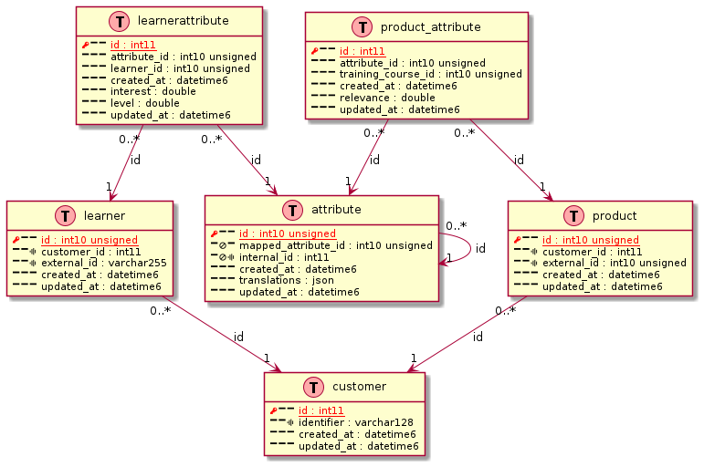

# bash-tools

<!-- markdownlint-capture -->
<!-- markdownlint-disable MD013 -->

Build status:
[](https://github.com/fchastanet/bash-tools2/actions/workflows/push_branch.yml)
[](http://opensource.box.com/badges)
[](https://deepsource.io/gh/fchastanet/bash-tools2/?ref=repository-badge)
[](https://deepsource.io/gh/fchastanet/bash-tools2/?ref=repository-badge)
[](http://isitmaintained.com/project/fchastanet/bash-tools2 'Average time to resolve an issue')
[](<http://isitmaintained.com/project/fchastanet/bash-tools2>
'Percentage of issues still open'

<!-- markdownlint-restore -->

- [1. Excerpt](#1-excerpt)
- [2. Installation/Configuration](#2-installationconfiguration)
- [3. The tools](#3-the-tools)
  - [3.1. bin/gitRenameBranch](#31-bingitrenamebranch)
  - [3.2. bin/dbQueryAllDatabases](#32-bindbqueryalldatabases)
  - [3.3. bin/dbScriptAllDatabases](#33-bindbscriptalldatabases)
  - [3.4. bin/dbImport](#34-bindbimport)
  - [3.5. bin/dbImportProfile](#35-bindbimportprofile)
  - [3.6. bin/cli](#36-bincli)
  - [3.7. bin/gitIsAncestorOf](#37-bingitisancestorof)
  - [3.8. bin/mysql2puml](#38-binmysql2puml)
- [4. Bash Framework](#4-bash-framework)
  - [4.1. UT](#41-ut)
  - [4.2. auto generated bash doc](#42-auto-generated-bash-doc)
- [5. Acknowledgements](#5-acknowledgements)

## 1. Excerpt

This is a collection of several bash tools using a bash framework allowing to
easily import bash script, log, display log messages, database manipulation,
user interaction, version comparison, ...

List of tools:

- **gitRenameBranch** : easy rename git local branch, use options to push new
  branch and delete old branch
- **cli** : easy connection to docker container
- **dbImport** : Import db from aws dump or mysql into target db
- **dbImportTable** : Import remote db table from aws or mysql into target db
- **dbQueryAllDatabases** : Execute a query on multiple database in order to
  generate a report, query can be parallelized on multiple databases
- **dbScriptAllDatabases** : same as dbQueryAllDatabases but you can execute an
  arbitrary script on each database
- **gitIsAncestor** : show an error if commit is not an ancestor of branch
- **gitIsBranch** : show an error if branchName is not a known branch
- **gitRenameBranch** : rename git local branch, use options to push new branch
  and delete old branch
- **waitForIt** : useful in docker container to know if another container port
  is accessible
- **waitForMysql** : useful in docker container to know if mysql server is ready
  to receive queries

## 2. Installation/Configuration

clone this repository and create configuration files in your home directory
alternatively you can use the **install.sh** script

```bash
git clone git@github.com:fchastanet/bash-tools.git
cd bash-tools
./install.sh
```

The following structure will be created in your home directory

<!-- markdownlint-capture -->
<!-- markdownlint-disable MD033 -->
<pre>
~/.bash-tools/
├── cliProfiles
│   ├── default.sh
│   ├── mysql.remote.sh
│   ├── mysql.sh
├── dbImportDumps
├── dbImportProfiles
│   ├── all.sh
│   ├── default.sh
│   ├── none.sh
├── dbQueries
│   └── databaseSize.sql
├── dsn
│   └── default.local.env
│   └── default.remote.env
│   └── localhost-root.env
└── .env
</pre>
<!-- markdownlint-restore -->

Some tools need [GNU parallel software](https://www.gnu.org/software/parallel/),
it allows running multiple processes in parallel. You can install it running

```bash
sudo apt update
sudo apt install -y parallel
# remove parallel nagware
mkdir ~/.parallel
touch ~/.parallel/will-cite
```

## 3. The tools

### 3.1. bin/gitRenameBranch

**Help**

```text
@@@gitRenameBranch_help@@@
```

### 3.2. bin/dbQueryAllDatabases

Execute a query on multiple database in order to generate a report, query can be
parallelized on multiple databases

```bash
bin/dbQueryAllDatabases -e localhost-root conf/dbQueries/databaseSize.sql
```

**Help**

```text
@@@dbQueryAllDatabases_help@@@
```

### 3.3. bin/dbScriptAllDatabases

Allow to execute a script on each database of specified mysql server

```bash
bin/dbScriptAllDatabases -d localhost-root dbCheckStructOneDatabase
```

or specified db only

```bash
bin/dbScriptAllDatabases -d localhost-root dbCheckStructOneDatabase db
```

launch script in parallel on multiple db at once

```bash
bin/dbScriptAllDatabases --jobs 10 -d localhost-root dbCheckStructOneDatabase
```

**Help:**

```text
@@@dbScriptAllDatabases_help@@@
```

### 3.4. bin/dbImport

Import default source dsn/db ExampleDbName into default target dsn/db
ExampleDbName

```bash
dbImport ExampleDbName
```

Ability to import db from dump stored on aws the dump file should have this name
`<fromDbName>.tar.gz` and stored on AWS location defined by S3_BASE_URL env
variable (see conf/.env file)

```bash
dbImport --from-aws ExampleDbName.tar.gz
```

It allows also to dump from source database and import it into target database.
Providing --profile option **dumps** only the tables selected. Providing
--tables option **imports** only the tables selected.

The following command will dump full structure and data of fromDb but will
insert only the data from tableA and tableB, full structure will be inserted
too. Second call to this command skip the dump as dump has been saved the first
time. Note that table A and table B are truncated on target database before
being imported.

```bash
dbImport --from-dsn default.remote --target-dsn default.local -p all fromDb targetDB --tables tableA,tableB
```

**Help**

```text
@@@dbImport_help@@@
```

### 3.5. bin/dbImportProfile

Import remote db into local db

```bash
dbImportProfile --from-dsn default.local MY_DB --ratio 45
```

Ability to generate profile that can be used in dbImport to filter out tables
bigger than given ratio (based on biggest table size). Profile is automatically
saved in ${HOME}/.bash-tools/dbImportProfiles with this format `auto*<dsn>*<db>`
**eg:** auto_default.local_MY_DB

**Help**

```text
@@@dbImportProfile_help@@@
```

### 3.6. bin/cli

**Help**

```text
@@@cli_help@@@
```

easy connection to docker container

**Example 1: open bash on a container named web**

```bash
cli web
```

will actually execute this command : MSYS_NO_PATHCONV=1 MSYS2_ARG_CONV_EXCL='\*'
docker exec -it -e COLUMNS="$(tput cols)" -e LINES="$(tput lines)" --user=
apache2 //bin/bash

**Example 2: connect to mysql container with root user**

```bash
cli mysql root bash
```

will actually execute this command : MSYS_NO_PATHCONV=1 MSYS2_ARG_CONV_EXCL='\*'
docker exec -e COLUMNS="$(tput cols)" -e LINES="$(tput lines)" -it --user=root
project-mysql bash

**Example 3: connect to mysql server in order to execute a query**

will actually execute this command : MSYS_NO_PATHCONV=1 MSYS2_ARG_CONV_EXCL='\*'
docker exec -it -e COLUMNS="$(tput cols)" -e LINES="$(tput lines)" --user=mysql
project-mysql //bin/bash -c 'mysql -h127.0.0.1 -uroot -proot -P3306'

**Example 4: pipe sql command to mysql container**

```bash
echo 'SELECT
  table_schema AS "Database",
  ROUND(SUM(data_length + index_length) / 1024 / 1024, 2) AS "Size (MB)"
FROM information_schema.TABLES' | bin/cli mysql
```

will actually execute this command : MSYS_NO_PATHCONV=1 MSYS2_ARG_CONV_EXCL='\*'
docker exec -i -e COLUMNS="$(tput cols)" -e LINES="$(tput lines)" --user=mysql
project-mysql //bin/bash -c 'mysql -h127.0.0.1 -uroot -proot -P3306' notice that
as input is given to the command, tty option is not provided to docker exec

### 3.7. bin/gitIsAncestorOf

**Help**

```text
@@@gitIsAncestorOf_help@@@
```

### 3.8. bin/mysql2puml

**Help**

```text
@@@mysql2puml_help@@@
```

Mysql dump of some tables

```bash
mysqldump --skip-add-drop-table --skip-add-locks --skip-disable-keys --skip-set-charset \
  --host=127.0.0.1 --port=3345 --user=root --password=root --no-data skills \
  $(mysql --host=127.0.0.1 --port=3345 --user=root --password=root skills \
    -Bse "show tables like 'core\_%'") \
  | grep -v '^\/\*![0-9]\{5\}.*\/;$' > doc/schema.sql
```

Transform mysql dump to plant uml format

```bash
mysql2puml tests/tools/data/mysql2puml.dump.sql -s default > tests/tools/data/mysql2puml.puml
```

Plantuml diagram generated

```plantuml
@@@mysql2puml_plantuml_diagram@@@
```

using plantuml software, here an example of resulting diagram



## 4. Bash Framework

All these tools are based on _Bash framework_ with the following features:

- A bootstrap that allows to import automatically .env file in home folder or
  ~/.bash-tools folder in order to load some environment variables
- **import alias** allows to import (only once) a bash file found in following
  folders (in order)
  - vendor/bash-framework
  - vendor
  - calling script path
  - absolute path
- **source alias**, same as import but multiple times import allowed
- Framework
  - **Framework::expectUser** exits with message if current user is not the
    expected one
  - **Framework::expectNonRootUser** exits with message if current user is root
- Database
  - **Database::dump** dump db limited to optional table list
  - **Database::query** mysql query on a given db
  - **Database::dropTable** drop table if exists
  - **Database::dropDb** drop database if exists
  - **Database::createDb** create database if not already existing
  - **Database::isTableExists** check if table exists on given db
  - **Database::ifDbExists** check if given database exists
  - all these methods need to call **Database::newInstance** in order to
    reference target db connection
- Array
  - **Array::contains** check if an element is contained in an array
- Functions
  - **Functions::checkCommandExists** check if command specified exists or exits
    with error message if not
  - **Functions::isWindows** determine if the script is executed under windows
    (git bash, wsl)
  - **Functions::quote** quote a string replace ' with \'
  - **Functions::addTrap** add a trap to existing trap or simply set the trap if
    no existing trap
- UI
  - **UI::askToContinue** ask the user if he wishes to continue a process
  - **UI::askYesNo** ask the user a confirmation
  - **UI::askToIgnoreOverwriteAbort** ask the user to ignore(i), overwrite(o) or
    abort(a)
- Version
  - **Version::checkMinimal** ensure that command exists with expected version
  - **Version::compare** compares two versions
- Log::display\* output colored message on error output and log the message
  - **Log::fatal** error message in red bold and exits with code 1
  - **Log::displayError** error message in red
  - **Log::displayWarning** warning message in yellow
  - **Log::displayInfo** info message in white on lightBlue
  - **Log::displaySuccess** success message in green
  - **Log::displayDebug** debug message in grey
- Log::log\* output message in a log file
  - **Log::logError**
  - **Log::logWarning**
  - **Log::logInfo**
  - **Log::logSuccess**
  - **Log::logDebug**

**Usage:** simply add these lines to your script

```bash
#!/usr/bin/env bash

# load bash-framework
# shellcheck source=bash-framework/_bootstrap.sh
CURRENT_DIR=$( cd "$( dirname "${BASH_SOURCE[0]}" )" && pwd )
source "$( cd "${CURRENT_DIR}/.." && pwd )/bash-framework/_bootstrap.sh"

# bash framework is loaded, .env has been loaded (default .env file present in bash-framework is loaded if none exists yet)

# exits with message if this script is executed using root user
Framework::expectNonRootUser

# import some useful apis
import bash-framework/Database
import bash-framework/Array
```

### 4.1. UT

All the methods of this framework are unit tested, you can run the unit tests
using the following command

```bash
./test.sh
```

### 4.2. auto generated bash doc

generated by running

```bash
./.github/buildScripts/doc.sh
```

@@@bash_doc_index@@@

## 5. Acknowledgements

Like so many projects, this effort has roots in many places.

I would like to thank particularly Bazyli Brzóska for his work on the project
[Bash Infinity](https://github.com/niieani/bash-oo-framework). Framework part of
this project is largely inspired by his work(some parts copied). You can see his
[blog](https://invent.life/project/bash-infinity-framework) too that is really
interesting
