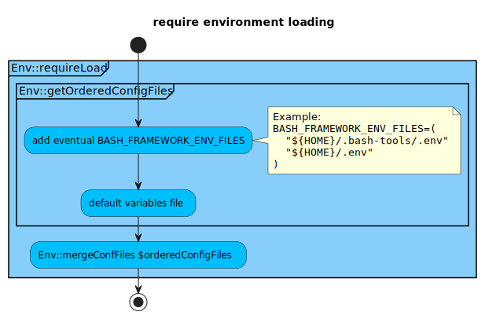

# Configuration files documentation

- [1. Config file format and loading rules](#1-config-file-format-and-loading-rules)
- [2. Config file overloading values](#2-config-file-overloading-values)
- [3. Config files loading order](#3-config-files-loading-order)

[Inspired by Evan "Hippy" Slatis work](https://opensource.com/article/21/5/processing-configuration-files-shell)

## 1. Config file format and loading rules

Configuration files loading is following these rules or best practices:

- all env files are now loaded as properties file, it means bash arrays cannot
  be declared Eg: arrays should be converted to a string list separated by
  colon, and has to converted when needed.
- All .env files have the ability to override value by env variable
- all variables have to be written on one line, it is not possible to cut lines
  over multiple line
- First variable set takes precedence, so writing following file would result to
  VAR1=value1

```bash
VAR1=value1
VAR1=value2
```

## 2. Config file overloading values

- Best practice is to override variables only by
  - command argument --env-file to allow loading alternate env before other
    default files
  - command argument (--verbose, ...) allows to override default displayed log
    level
- Provide --config argument to see resulting config file + information about
  order of loaded config files for debugging purpose.
- It is also possible to use environment variable, but **highly discouraged to
  generalize this practice** as it could lead to unwanted results if variables
  are not well scoped.

- [1. Config file format and loading rules](#1-config-file-format-and-loading-rules)
- [2. Config file overloading values](#2-config-file-overloading-values)
- [3. Config files loading order](#3-config-files-loading-order)

## 3. Config files loading order

<!-- markdownlint-capture -->
<!-- markdownlint-disable MD033 -->

<a name="config_file_order" id="config_file_order"></a>

<!-- markdownlint-restore -->

The framework function `Env::getOrderedConfigFiles` allows to get the list of
configuration files that will called by `Env::requireLoad` function. You can
override `Env::getOrderedConfigFiles` in your own project for your own needs.
Here the rules used in `Env::getOrderedConfigFiles`:

- Load files from more specific to the project to the less specific.
- Last file contains all the mandatory default properties' values.
- The following files will be loaded in this order if they are existing and are
  readable:

  - if env-file argument is passed, load the provided file first
  - if --verbose or -v argument is passed, set `BASH_FRAMEWORK_DISPLAY_LEVEL` to
    3 (INFO)
  - if -vv argument is passed, set `BASH_FRAMEWORK_DISPLAY_LEVEL` to 4 (DEBUG)
  - later on, will manage other kind of arguments
  - additional files provided by this bash array variable, see below.
  - framework default values file, see below.

_Eg:_ additional environment files

```bash
BASH_FRAMEWORK_ENV_FILES=("${HOME}/.bash-tools/.env" "${HOME}/.env")
```

_Eg:_ framework default values file

```bash
BASH_FRAMEWORK_LOG_LEVEL="${BASH_FRAMEWORK_LOG_LEVEL:-0}"
BASH_FRAMEWORK_DISPLAY_LEVEL="${BASH_FRAMEWORK_DISPLAY_LEVEL:-${__LEVEL_WARNING}}"
BASH_FRAMEWORK_LOG_FILE="${BASH_FRAMEWORK_LOG_FILE:-"${FRAMEWORK_ROOT_DIR}/logs/${SCRIPT_NAME}.log"}"
BASH_FRAMEWORK_LOG_FILE_MAX_ROTATION=${BASH_FRAMEWORK_LOG_FILE_MAX_ROTATION:-5}"
```



[activity diagram source code](https://github.com/fchastanet/bash-tools-framework/blob/master/src/Env/activityDiagram.puml).
